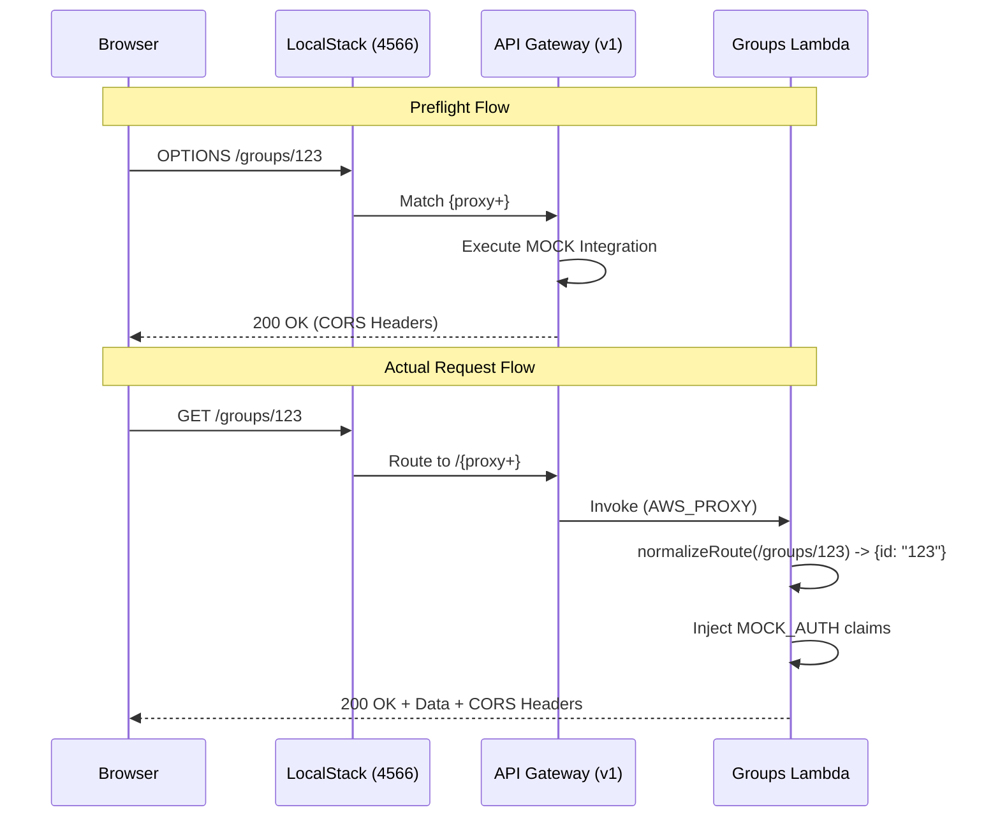
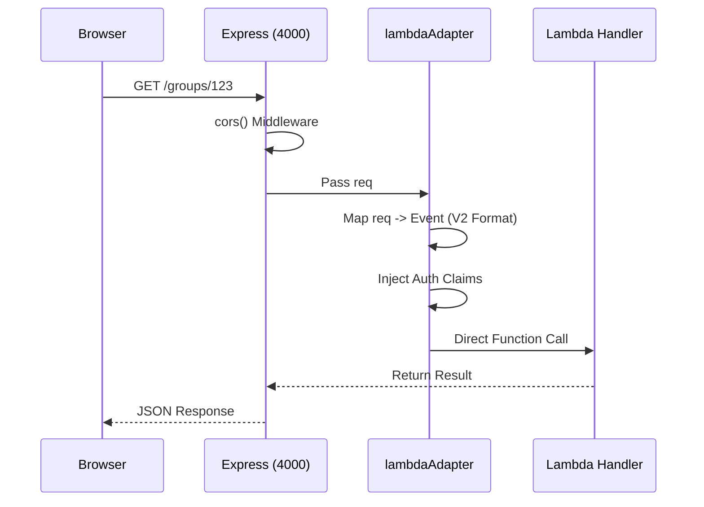

# 💸 CostsCrunch
### Serverless Expense Tracker · Individual / Group / Business

> **MVP Boilerplate** built on the AWS serverless architecture blueprint: Lambda + DynamoDB + Cognito + S3 + API Gateway + Textract + Bedrock

---

## Architecture Overview

```
📱 React / React Native / Flutter
        ↓
🌍 CloudFront (CDN + TLS 1.3 + HTTP/3)
        ↓
🛡️ WAF v2 (OWASP rules + rate limiting)
        ↓
🔑 Cognito (JWT auth + MFA + PKCE)
        ↓
🔀 API Gateway REST API v1 (Standardized for LocalStack parity)
        ↓
⚡ ElastiCache Redis (response cache + sessions)
        ↓
⚙️ AWS Lambda (Node.js 20 + Powertools + Vitest)
     ├── expenses/       CRUD + approval workflows
     ├── groups/         splits + balances + settlements
     ├── receipts/       S3 → Textract async triggering
     ├── image-preprocess/ Lossless image compression (Sharp)
     ├── sns-webhook/    Textract completion → Claude AI → DB
     ├── ws-notifier/    Real-time WebSocket updates
     ├── analytics/      aggregations + trends
     └── notifications/  SES + Pinpoint push/SMS
        ↓
🗄️ DynamoDB (Global Tables us-east-1 / us-west-2)
📦 S3 (uploads + processed + receipts + assets, KMS encrypted)
🔍 EventBridge (async event bus)
📡 CloudWatch + X-Ray (observability)
```

---

## Repository Structure
```
costscrunch
├── ai/                      # Agent prompts, domain skills, and system configs
├── backend/
│   ├── __tests__/           # Unit (mocked) and Integration (LocalStack) suites
│   ├── src/
│   │   ├── lambdas/         # Service handlers (Groups, Expenses, Analytics, etc.)
│   │   ├── _local/          # Local dev auth wrappers (mock authorizer)
│   │   ├── shared/          # Domain models and common types
│   │   └── server.ts        # Express-to-Lambda adapter for fast dev cycles
│   └── vite.config.ts
├── frontend/
│   ├── __tests__/           # Component and Store unit tests (Vitest + RTL)
│   ├── src/
│   │   ├── components/      # UI Building blocks (Modals, Rows, Charts)
│   │   ├── pages/           # Route containers and view logic
│   │   ├── services/        # Type-safe API client (Amplify-integrated)
│   │   ├── stores/          # Zustand state management
│   │   └── models/          # Frontend-specific type definitions
│   └── vite.config.ts
└── infrastructure/
    ├── __tests__/           # REST v1 validation and Data compliance checks
    ├── localstack/          # Provisioning (Setup & Bootstrap) for Option 2
    ├── sam/                 # Local emulation templates (REST v1 / ARM64)
    ├── stacks/              # CDK Infrastructure-as-Code definitions
    └── docker-compose.yml   # Multi-container orchestration (LocalStack base)
```

---

## DynamoDB Single-Table Design

| pk | sk | Entity | Notes |
|---|---|---|---|
| `USER#uid` | `PROFILE#uid` | User profile | Main user record |
| `USER#uid` | `EXPENSE#expId` | Personal expense | User's own expenses |
| `USER#uid` | `GROUP_MEMBER#gid` | Group membership | Denormalized for fast lookup |
| `USER#uid` | `NOTIFICATION#ts` | Notification | TTL 90 days |
| `GROUP#gid` | `PROFILE#gid` | Group profile | Includes members array |
| `GROUP#gid` | `EXPENSE#expId` | Group expense | Expenses shared to group |
| `EMAIL#email` | `USER#uid` | Email index | Login by email lookup |
| `RECEIPT#expId` | `SCAN#scanId` | Scan result | TTL 30 days |

**GSI1:** `gsi1pk = STATUS#status`, `gsi1sk = DATE#date#expId`  
→ Query all expenses by status + date range (admin approval queue)

**GSI2:** `gsi2pk = CATEGORY#category`, `gsi2sk = DATE#date#expId`  
→ Analytics queries by category + time period

---

## Receipt Scan Pipeline

### Image Preprocessing Layer (NEW)

All user uploads now pass through a lossless compression layer before Textract processing:

```
┌─────────────────────────────────────────────────────────────────┐
│                    IMAGE PREPROCESSING PIPELINE                 │
├─────────────────────────────────────────────────────────────────┤
│                                                                 │
│  ┌──────────────┐    ┌───────────────────┐    ┌──────────────┐  │
│  │ UploadsBucket│───▶│ image-preprocess  │───▶│ProcessBucket │  │
│  │  (uploads/)  │    │     Lambda        │    │ (receipts/)  │  │
│  └──────────────┘    └───────────────────┘    └──────────────┘  │
│         │                     │                     │           │
│         │              ┌──────┴──────┐              │           │
│         │              │   SHARP     │              │           │
│         │              │ compression │              │           │
│         │              └──────┬──────┘              │           │
│         │                     │                     │           │
│    3-day TTL            JPEG: quality 100     30-day TTL        │
│    (auto-cleanup)       PNG:  level 9         (long-term)       │
│                         HEIC→JPEG convert                       │
│                         PDF: pass-through                       │
└─────────────────────────────────────────────────────────────────┘
```

**Benefits:**
- **Cost reduction:** Smaller files = lower Textract costs (charged per page)
- **Faster processing:** Reduced S3 transfer time
- **Storage optimization:** Compressed images stored long-term
- **HEIC support:** iPhone photos auto-converted to JPEG

**Compression settings:**
| Format | Settings | Typical Reduction |
|--------|----------|-------------------|
| JPEG | quality: 100, mozjpeg: true | 10-30% |
| PNG | compressionLevel: 9, adaptiveFiltering | 15-40% |
| HEIC | → JPEG (quality: 100) | N/A (format change) |
| PDF | Pass-through unchanged | 0% |

### Full Pipeline Flow

```
User uploads file
      ↓
[Frontend] POST /receipts/upload-url
      ↓
[API] receipts Lambda generates S3 presigned POST URL
      │  → Bucket: UploadsBucket
      │  → Key prefix: uploads/{userId}/{expenseId}/{scanId}/
      ↓
[Frontend] POST directly to S3 (no Lambda in path = cheap + fast)
      ↓
[S3 Event] Triggers image-preprocess Lambda
      ↓
[Lambda] Compresses image using Sharp (lossless)
      ↓
[Lambda] Uploads to ProcessedBucket with key: receipts/{userId}/{expenseId}/{scanId}/
      ↓
[S3 Event] Triggers receipts Lambda (index.ts)
      ↓
[Lambda] Writes scan record to DynamoDB  →  status: "processing"
      ↓
[Lambda] StartExpenseAnalysis (async) with SNS NotificationChannel + JobTag
      ↓
    Lambda returns immediately — no polling, no timeout risk
      ↓
         ╔══════════════════════════════════╗
         ║ Textract processes file(10–90s)  ║
         ╚══════════════════════════════════╝
      ↓
[SNS] textract-completion topic receives job completion notification
      ↓
[sns-webhook Lambda] Triggered by SNS
      ↓
[Lambda] GetExpenseAnalysis (instant — job already done)
      ↓
[Lambda] Parses: merchant, amount, date, tax, tip, line items
      ↓
[Lambda] Claude 3 Haiku (Bedrock) → category + confidence + policy flags
             ↓ (on Bedrock failure)
         [Fallback] guessCategory() keyword matching → confidence: 85
      ↓
[DynamoDB] Updates scan record  →  status: "completed"
[DynamoDB] Back-fills expense record  →  merchant, amount, category (if_not_exists)
      ↓
[EventBridge] Emits ReceiptScanCompleted
      ↓
      ├──────────────────────────────────────────────┐
      ↓                                              ↓
[Notifications Lambda]                    [ws-notifier Lambda]
Sends email / push / Pinpoint             Looks up connectionId(s) in
to user                                   DynamoDB connections table
                                                     ↓
                                          [API Gateway WebSocket]
                                          POST @connections → browser
                                                     ↓
                                    ┌────────────────┴────────────────┐
                                    ↓                                 ↓
                             [WebSocket message]               [Timeout / error]
                             RECEIPT_SCAN_COMPLETED            fallbackHttpGet()
                             resolves watchScanResult()        GET /receipts/{id}/scan
                                    ↓                                 ↓
                                    └─────────────┬───────────────────┘
                                                  ↓
                                    [Frontend] UI updated with
                                    merchant, amount, category,
                                    confidence, policy flags
```

**Supported inputs:** JPG, PNG, HEIC, PDF  
**Processing time:** 10–90 seconds (Textract async job)  
**AI confidence:** typically 88–98%  
**Fallback:** keyword-based categorization if Bedrock unavailable  

### Backwards Compatibility

The preprocessing layer is designed for seamless backwards compatibility:

| Scenario | Behavior |
|----------|----------|
| **Existing frontend** | No changes required — upload URL endpoint returns new bucket/key transparently |
| **Direct ProcessedBucket upload** | Still works — receipts Lambda triggers on `receipts/` prefix in ProcessedBucket |
| **Missing BUCKET_UPLOADS_NAME** | Falls back to BUCKET_RECEIPTS_NAME for upload URLs |
| **HEIC files** | Now supported — auto-converted to JPEG during preprocessing |
| **API response shape** | Unchanged — still returns `{ url, fields, key, expenseId, scanId }` |

**Migration path for existing deployments:**
1. Deploy new UploadsBucket and ProcessedBucket (CDK handles creation)
2. Deploy image-preprocess Lambda
3. Update receipts Lambda env vars: add `BUCKET_UPLOADS_NAME`, `BUCKET_PROCESSED_NAME`
4. Update S3 event sources via CDK (automatic on deploy)
5. No frontend changes required

---

## Group Expense Splitting

```typescript
// Split methods
"equal"      // divide equally among all members
"exact"      // specify exact amounts per person
"percentage" // specify percentages (must sum to 100)
"shares"     // weighted shares (e.g. 2:1:1 → 50%/25%/25%)

// Debt minimization algorithm (O(n) simplified)
// Converts N*(N-1)/2 possible transactions → at most N-1
// Example: A owes B $30, B owes C $30 → A pays C $30 directly
```

---

## Security Posture

| Layer | Control |
|---|---|
| Edge | CloudFront + WAF OWASP rules + Shield |
| Auth | Cognito JWT (RS256) + PKCE + MFA optional |
| Network | VPC private subnets + VPC Endpoints (no internet for AWS APIs) |
| Data | DynamoDB + S3 encrypted with KMS CMK |
| Secrets | Secrets Manager + 30-day auto-rotation |
| Audit | CloudTrail + GuardDuty + Security Hub |
| Code | Semgrep SAST + npm audit + Gitleaks in CI |
| IAM | Least-privilege per-Lambda roles, no wildcards |

---

## API Endpoints

```
AUTH (all endpoints require Bearer JWT)

Expenses
  GET    /expenses                    list with filters
  POST   /expenses                    create
  GET    /expenses/:id                get single
  PATCH  /expenses/:id                update / approve / reject
  DELETE /expenses/:id                delete

Groups
  GET    /groups                      list my groups
  POST   /groups                      create group
  GET    /groups/:id                  get group
  PATCH  /groups/:id                  update settings
  GET    /groups/:id/balances         balances + settlement plan
  POST   /groups/:id/members          invite member
  DELETE /groups/:id/members/:userId  remove member

Receipts
  POST   /receipts/upload-url         get S3 pre-signed URL
  GET    /receipts/:expenseId/scan    poll scan result

Analytics
  GET    /analytics/summary?period=month|quarter|year
  GET    /analytics/trends
```

---

## Environment Variables

```bash
# Environment & Global Settings
ENVIRONMENT=
PREFIX=
AWS_REGION=
AWS_ACCESS_KEY_ID=
AWS_SECRET_ACCESS_KEY=
AWS_ENDPOINT_URL=

# Logging & Observability (Powertools)
LOG_LEVEL=
DEBUG_EVENT=
POWERTOOLS_SERVICE_NAME=
POWERTOOLS_METRICS_NAMESPACE=
POWERTOOLS_LOGGER_LOG_EVENT=

# Data & Storage (DynamoDB & S3)
TABLE_NAME_MAIN=
TABLE_NAME_CONNECTIONS=
BUCKET_UPLOADS_NAME=        # NEW: User upload bucket (preprocessing input)
BUCKET_PROCESSED_NAME=      # NEW: Compressed images (preprocessing output)
BUCKET_RECEIPTS_NAME=       # DEPRECATED: Use UPLOADS/PROCESSED for new deployments
BUCKET_ASSETS_NAME=

# Events & Messaging (EventBridge, SNS, SQS)
EVENT_BUS_NAME=
TEXTRACT_SNS_TOPIC_ARN=
TEXTRACT_ROLE_ARN=
FROM_EMAIL=

# Auth, Cache & APIs (Cognito, Redis, WebSocket)
USER_POOL_ID=
REDIS_HOST=
REDIS_PORT=
WEBSOCKET_ENDPOINT=

# IAM & Third-Party Services (Bedrock, Textract)
BEDROCK_MODEL_ID=```

---

## Local Development

### Prerequisites
```bash
Node 20+, AWS CLI, CDK CLI, Docker (for LocalStack), SAM CLI (for Option 3)
npm install -g aws-cdk aws-sam-cli
npm install
```

### Local Request-Response Flows

Understanding how data moves through local environments is critical for troubleshooting routing and CORS.

#### Option 2 Flow (Full LocalStack Compute)
Standardizes on **REST API v1** to ensure feature parity with free-tier LocalStack.


#### Option 3 Flow (SAM CLI + Express)
Uses a **Hono-style adapter** to bridge Express and Lambda locally.


### Key Differences from Production

| Feature | Local (Opt 2/3) | Production (AWS) |
| :--- | :--- | :--- |
| **API Version** | **REST API v1** (Hierarchical). | **HTTP API v2** (Flat/Global). |
| **CORS Enforce** | **Dual-Layer Required**: Gateway Mock + Lambda Headers. | **Single-Layer**: Usually handled by API Gateway "CORS Support" or CloudFront Policies. |
| **Authorizer** | **Synthetic**: `MOCK_AUTH` wrapper in Lambda or Adapter. | **Managed**: Real Cognito JWT validation, MFA, and Token revocation. |
| **Routing** | **Manual Bridge**: Requires `normalizeRoute()` to map path segments to templates. | **Native**: AWS handles parameter mapping from URL patterns automatically. |
| **IAM/WAF** | **CRUD-Only**: Policies exist but are not enforced in LocalStack Free. | **Active**: Strict enforcement of Least Privilege and OWASP Rate Limiting. |
| **Persistence** | **Ephemeral**: State is lost on container restart unless using volume mounts. | **Durable**: Point-in-Time Recovery and Multi-Region Replication active. |

---

### Three Local Stack Options

The original LocalStack setup only provisioned the **data layer** (DynamoDB, S3, SSM, etc.) — no Lambda functions or API Gateway. This caused 404s when the frontend called API endpoints. Three options now exist, each solving this differently:

| | Option 1 | Option 2 | Option 3 |
|---|---|---|---|
| **Compute layer** | ❌ None | ✅ Lambda + API GW inside LocalStack | ✅ SAM CLI local invoke |
| **Data layer** | ✅ LocalStack (setup.sh) | ✅ LocalStack (setup.sh) | ✅ LocalStack (setup.sh) |
| **Auth bypass** | N/A | `MOCK_AUTH=true` env var | `MOCK_AUTH=true` + `_local/` wrappers |
| **Complexity** | Low | Medium | Medium |
| **Use when** | Testing infra services only | Full local API with LocalStack | Full local API without Docker compute |

---

#### Option 1 — Data Layer Only (Original)

Good for testing DynamoDB, S3, SSM, etc. No API endpoints available.

```bash
cd infrastructure && docker compose -f docker-compose.localstack.yml up -d
# setup.sh seeds data automatically on container start
# Frontend will 404 on API calls — this is expected
```

#### Option 2 — Full LocalStack (Lambda + API GW Inside Container)

Provisions IAM role, 6 Lambda functions, REST API (v1) with hierarchical resource mapping, and automated CORS enforcement. `setup.sh` seeds data; `bootstrap.sh` provisions compute.

```bash
# 1. Start base LocalStack (data seeding)
cd infrastructure
docker compose -f docker-compose.localstack.yml up -d

# 2. Start supplemental compute container (Lambda + API GW)
docker compose -f localstack/opt2/docker-compose.opt2.yml up -d

until docker exec costscrunch-localstack-seed echo "✅✅✅ LocalStack seed complete!" >/dev/null 2>&1; do
  sleep 20
done

# 3. Build Lambda code and mount into container
cd ../backend
npm run build   # produces esbuild bundles

# 4. Copy build artifacts into LocalStack's expected SAM build path
#    bootstrap.sh expects /opt/sam-build/{FunctionName}/ inside the container
docker exec costscrunch-localstack mkdir -p /opt/bootstrap
docker exec costscrunch-localstack mkdir -p /opt/sam-build-src
docker cp "$PROJECT_ROOT/infrastructure/localstack/opt2/bootstrap.sh" costscrunch-localstack:/opt/bootstrap/bootstrap.sh
docker cp "$PROJECT_ROOT/backend/src" costscrunch-localstack:/opt/sam-build-src
# (See opt2/README.md for full sam build instructions)

# 5. Run bootstrap inside the Lambda container
docker exec costscrunch-localstack bash /opt/bootstrap/bootstrap.sh

# 6. Set frontend API URL
export VITE_API_URL="http://localhost:4566/restapis/{API_ID}/local/_user_request_"
# API_ID is printed by bootstrap.sh. If CORS blocks persist, run the enforcer:
docker exec costscrunch-localstack enable-cors {API_ID}

# 7. Start frontend
cd ../frontend && npm run dev
```

#### Option 3 — SAM CLI Local (Recommended for Development)

Uses `sam local start-api` to run Lambda functions locally, proxying data calls to LocalStack. Requires SAM CLI but no Docker compute setup.

```bash
# 1. Start LocalStack for data layer only
cd infrastructure && docker compose -f docker-compose.localstack.yml up -d

# 2. Build SAM template
cd ../infrastructure/sam
sam build

# 3. Start local API (Lambda functions run locally, data goes to LocalStack)
sam local start-api \
  --env-vars env.json \
  --parameter-overrides 'ParameterKey=AppUrl,ParameterValue=http://localhost:3000'

# 4. In another terminal — set frontend to SAM's local endpoint
cd ../../frontend
export VITE_API_URL="http://localhost:3001"   # SAM default port
npm run dev
```

**Key difference:** Option 3's `_local/` handler wrappers import the real handlers and wrap them with `withMockAuth()` middleware, which injects fake Cognito claims when `MOCK_AUTH=true`. This means the same handler code runs locally and in production — only the auth context differs.

---

### Running Tests

```bash
# Infrastructure tests
cd infrastructure
npm test                                        # all infra tests (opt3 runs, opt2 skips without LocalStack)
npx vitest run __tests__/opt3                   # Option 3 unit tests only (no LocalStack needed)
npx vitest run __tests__/opt2                   # Option 2 integration tests (requires LocalStack + bootstrap)
npx vitest run __tests__/localstack             # Service-level LocalStack tests

# Backend tests
cd backend
npm run test:ut                                 # unit tests
npm run test:ig                                 # integration tests (requires LocalStack)

# Frontend tests
cd frontend && npx vitest
```

### Deploy to AWS

```bash
npm run deploy:dev
```

---

## Scaling Notes

| Component | 10K CCU handling |
|---|---|
| Lambda | Reserved concurrency 500/fn, provisioned 50 for critical paths |
| DynamoDB | On-demand — scales to millions of requests/sec automatically |
| API Gateway | 10,000 req/s burst limit (increase via AWS Support) |
| Redis | r7g.large cluster, TTL-based eviction, ~85% cache hit rate |
| S3 + Textract | No concurrency limits — scales independently |
| Cognito | Handles millions of JWT validations at edge |

**Cost estimate at 100K MAU:** ~$450/month  
**Cost estimate at 1M MAU:** ~$4,355/month ($0.004/user/month)

---

## CI/CD Deployment

### Pipeline Overview

```
┌─────────────────────────────────────────────────────────────────────────────┐
│                              CI Workflow                                    │
│  Trigger: push/PR to main, staging                                          │
├─────────────────────────────────────────────────────────────────────────────┤
│  ┌──────────────┐   ┌──────────────┐   ┌──────────────────────┐             │
│  │   Quality    │   │   Security   │   │        Build         │             │
│  │    Gate      │   │    Scan      │   │                      │             │
│  ├──────────────┤   ├──────────────┤   ├──────────────────────┤             │
│  │ • Frontend   │   │ • Semgrep    │   │ • Backend bundle     │             │
│  │ • Backend    │   │ • npm audit  │   │ • Frontend build     │             │
│  │ • Infra      │   │ • Gitleaks   │   │ • CDK synth          │             │
│  └──────────────┘   └──────────────┘   └──────────────────────┘             │
│                              │                                              │
│                              ▼                                              │
│                    ┌──────────────────┐                                     │
│                    │    Artifacts     │                                     │
│                    │  (7-day retain)  │                                     │
│                    └──────────────────┘                                     │
└─────────────────────────────────────────────────────────────────────────────┘
                              │
                              ▼
┌─────────────────────────────────────────────────────────────────────────────┐
│                              CD Workflow                                    │
│  Trigger: CI success (workflow_run) or manual dispatch                      │
├─────────────────────────────────────────────────────────────────────────────┤
│                                                                             │
│  ┌────────────────┐    ┌────────────────┐    ┌────────────────┐             │
│  │    Staging     │───▶│    E2E Tests   │───▶│   Production   │             │
│  │                │    │   (Playwright) │    │   (protected)  │             │
│  ├────────────────┤    └────────────────┘    ├────────────────┤             │
│  │ • CDK deploy   │           │              │ • CDK deploy   │             │
│  │ • S3 sync      │           │              │ • S3 sync      │             │
│  │ • Smoke test   │           │              │ • CF invalidate│             │
│  └────────────────┘           │              │ • Smoke test   │             │
│                               │              │ • Slack notify │             │
│                               ▼              └────────────────┘             │
│                      ┌────────────────┐                                     │
│                      │   Rollback     │  (manual trigger only)              │
│                      │  (on failure)  │                                     │
│                      └────────────────┘                                     │
└─────────────────────────────────────────────────────────────────────────────┘
```

### Required GitHub Secrets

| Secret | Description | Environment |
|--------|-------------|-------------|
| `AWS_ACCESS_KEY_ID_DEV` | AWS access key for CDK synth | CI |
| `AWS_SECRET_ACCESS_KEY_DEV` | AWS secret key for CDK synth | CI |
| `AWS_ACCESS_KEY_ID_STAGING` | AWS access key for staging deploy | CD |
| `AWS_SECRET_ACCESS_KEY_STAGING` | AWS secret key for staging deploy | CD |
| `AWS_ACCOUNT_ID_STAGING` | AWS account ID for staging | CD |
| `AWS_ACCESS_KEY_ID_PROD` | AWS access key for production | CD |
| `AWS_SECRET_ACCESS_KEY_PROD` | AWS secret key for production | CD |
| `AWS_ACCOUNT_ID_PROD` | AWS account ID for production | CD |
| `CODECOV_TOKEN` | Codecov coverage upload token | CI |
| `SEMGREP_APP_TOKEN` | Semgrep SAST token | CI |
| `VITE_API_URL` | Frontend API URL | CI |
| `VITE_USER_POOL_ID` | Cognito User Pool ID | CI |
| `VITE_USER_POOL_CLIENT_ID` | Cognito Client ID | CI |
| `STAGING_URL` | Staging base URL for E2E | CD |
| `STAGING_ASSETS_BUCKET` | S3 bucket for staging frontend | CD |
| `STAGING_CF_DISTRIBUTION_ID` | CloudFront distribution ID | CD |
| `PROD_ASSETS_BUCKET` | S3 bucket for production frontend | CD |
| `CF_DISTRIBUTION_ID` | Production CloudFront ID | CD |
| `TEST_USER_EMAIL` | Test user for E2E tests | CD |
| `TEST_USER_PASSWORD` | Test user password | CD |
| `SLACK_WEBHOOK_URL` | Slack notifications (optional) | CD |

### One-Time Setup

```bash
# 1. Bootstrap CDK in each environment (run once per account/region)
npx cdk bootstrap aws://ACCOUNT_ID/us-east-1

# 2. Create IAM user for CI/CD with minimal permissions
# Recommended: Use OIDC federation instead of access keys
# See: https://docs.github.com/en/actions/deployment/security-hardening-your-deployments

# 3. Configure GitHub repository secrets
# Go to: Settings → Secrets and variables → Actions → New repository secret

# 4. Enable GitHub Environments
# Go to: Settings → Environments → New environment
#   - staging: No approval required
#   - production: Add required reviewers
```

### Manual Deploy

```bash
# Via GitHub Actions UI
# Navigate to Actions → CD → Run workflow
# Select environment: staging | production

# Via CLI (for development)
npm run deploy:dev      # Deploy to dev environment
npm run deploy:staging  # Deploy to staging
npm run deploy:prod     # Deploy to production (requires approval)
```

### Rollback Procedure

```bash
# Automatic rollback via CloudFormation
aws cloudformation rollback-stack --stack-name costscrunch-prod-CostsCrunchStack

# Manual redeploy previous commit
git checkout HEAD~1
npm run deploy:prod

# Via GitHub Actions
# Actions → CD → Run workflow → Select "Rollback" option
```

### Environment Protection Rules

| Environment | Approval | Deployment Branch | Auto-Deploy |
|-------------|----------|-------------------|-------------|
| staging | None | main, staging | Yes (on CI success) |
| production | 1+ reviewers | main only | Yes (after staging) |

---

## Roadmap (Post-MVP)

- [ ] Plaid integration (automatic bank transaction sync)
- [ ] OCR for physical mileage logs
- [ ] QuickBooks / Xero export
- [ ] Multi-currency with live FX rates (via Exchange Rate API)
- [ ] Business policy engine (per-category spend limits)
- [ ] Mobile apps (React Native + Expo)
- [ ] Recurring expense detection (ML)
- [ ] Slack bot for expense submission
- [ ] CSV/PDF export + scheduled reports

---

## License

MIT — use freely for commercial and personal projects.